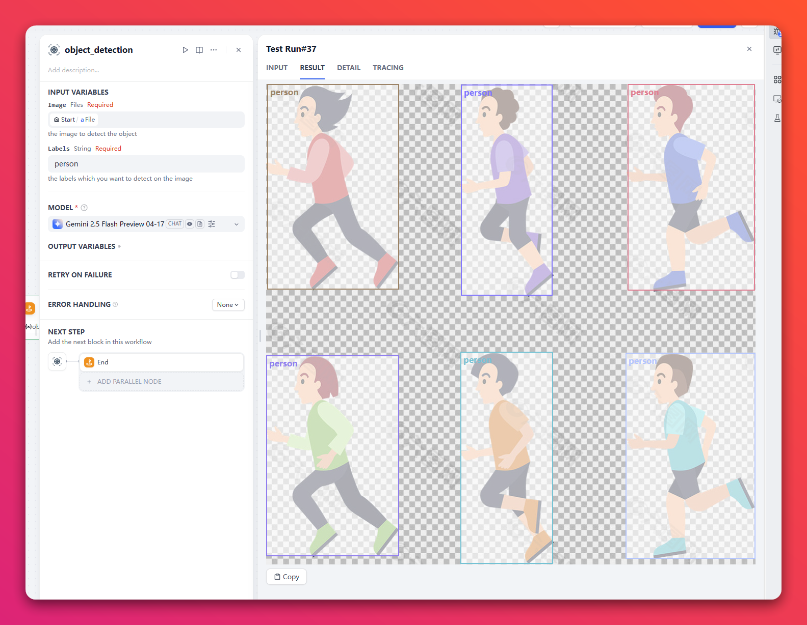

## Object Detection

**Co-Author:**  [leslie](https://github.com/leslie2046)、 hjlarry  
**Version:** 0.0.1  
**Type:** tool
**Repo:** [https://github.com/hjlarry/dify-plugin-object_detection](https://github.com/hjlarry/dify-plugin-object_detection)

### Description
A tool can detect the object of an image.

The input is an image, which label you want to detect, which model you want to use.
The output is the image with the label and the bounding box, and the labeled data.

For example:  

**Note: The gemini models always get a good result, but the other models may not.**